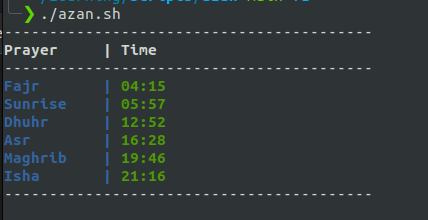

# Scripts

## Overview

- **azan:**
  - retrieves prayer timings for Cairo, Egypt, for the current date from the Aladhan API and presents them in a formatted table within the terminal.

  


## usage

1. make sure that azan.sh is executable. on Linux 

  ```
  chmod +x azan.sh
  ```
2. run `azan.sh`: 

  ``` 
  ./azan.sh
  ```

## Overview

- **csv to mysql:**
  - read data from a CSV file and insert it into a MySQL database table. It removes duplicate rows based on a specified column (e.g., phone_number) to ensure data uniqueness.

## usage

1. ensure you have the necessary dependencies installed:
    - ```python 3.x```
    - ```mysql-connector-python```
